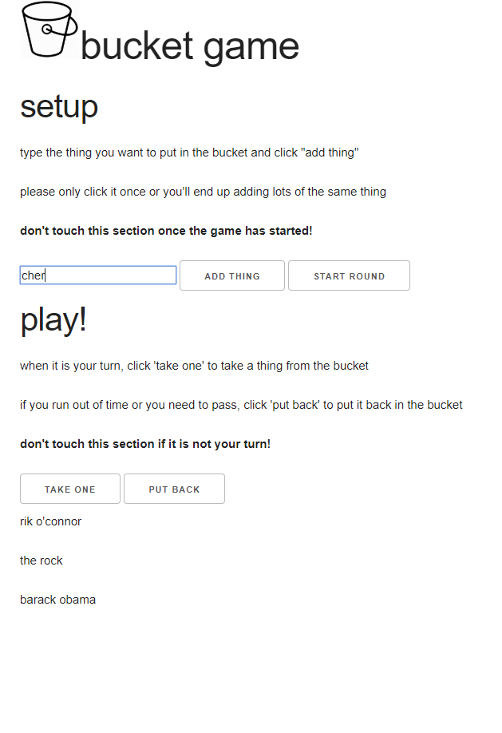

# bucketgame

simple web implementation of the bucket game.

to run, `stack run` brings the game server up on port 3000, then serve `index.html`, potentially by e.g. `python -m SimpleHTTPServer 8000`

